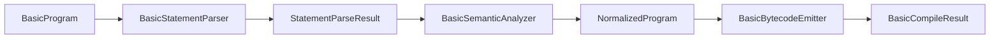

# Compiler architecture

This document describes the current BASIC compiler pipeline and phase boundaries.

## Phase overview

## Responsibilities

- `BasicStatementParser`
  - Parses BASIC source lines into statement AST nodes.
  - Produces syntax/shape diagnostics with source line numbers.
- `BasicSemanticAnalyzer`
  - Validates cross-line semantics (for example control-flow targets).
  - Converts statement AST into normalized backend IR.
  - Produces semantic diagnostics with source line numbers.
- `BasicBytecodeEmitter`
  - Lowers normalized IR into VM instructions.
  - Resolves jump addresses and appends implicit trailing `HALT` when required.
  - Guards malformed IR payloads and reports deterministic backend diagnostics.
- `BasicCompiler`
  - Orchestrates parse -> semantic -> emit.
  - Adapts phase diagnostics into `BasicCompileResult`.

## Data handoff contracts

- Parser output -> semantic input:
  - Statement AST may still include expression trees and raw target lines.
- Semantic output -> emitter input:
  - Control-flow targets are validated.
  - Statement forms are normalized in `BasicNormalizedIr`.
  - Emitter still validates required nullable payloads defensively.

## Diagnostic ownership

- Parser owns statement syntax diagnostics (for example malformed `IF THEN` target syntax).
- Semantic owns cross-line validity diagnostics (for example unknown target lines).
- Emitter owns malformed IR and expression-lowering diagnostics.
- `BasicCompiler` aggregates phase diagnostics into shell-visible compile errors.
