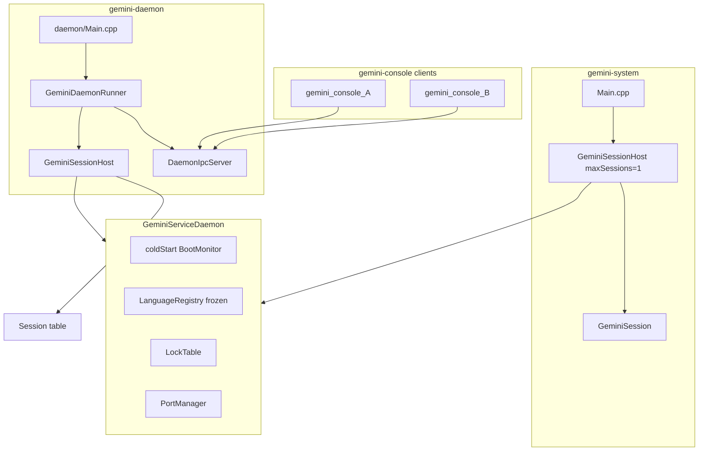

# Gemini Service Daemon (GSD)

The **Gemini Service Daemon** is the process-scope host for Gemini System: cold start, frozen language registry, shared lock table, port allocation, session table, and (for the long-running binary) a Unix domain IPC server for console attachment.

It is the architectural hinge between the M12 session object ([session model](session.md)) and multi-console attachment in [Milestone 14](milestones/14-multi-session-console-support.md) (implemented). Cooperative scheduling at session I/O boundaries is described in [Milestone 15](milestones/15-cooperative-multi-session-execution.md) (implemented).

See [Milestone 13](milestones/13-service-daemon-architecture.md) for delivery history and completion criteria.

## Entry points

All three binaries link the same daemon host implementation in `gemini-core` / `gemini-tcl` — not parallel codebases.

| Binary | Edition | Composition | I/O / IPC |
|--------|---------|-------------|-----------|
| **`gemini-system`** | Application | [`createEmbedded()`](../src/core/daemon/GeminiServiceDaemon.cpp) → [`GeminiSessionHost`](../src/userland/tcl/GeminiSessionHost.h) (`maxSessions = 1`) → one [`GeminiSession`](../src/userland/tcl/GeminiSession.h) → login/REPL | `stdin` / `stdout` / `stderr`; **no IPC server** |
| **`gemini-daemon`** | Service | [`create(config)`](../src/core/daemon/GeminiServiceDaemon.cpp) → `GeminiSessionHost` → [`GeminiDaemonRunner`](../src/userland/tcl/GeminiDaemonRunner.cpp) | Unix domain socket; accepts multiple [`gemini-console`](console.md) clients; session workers run login/REPL per attach |
| **`gemini-console`** | Service (client) | [`DaemonIpcClient`](../src/core/daemon/DaemonIpcClient.h) only (links `gemini-core`) | Terminal ↔ daemon session I/O over IPC; requires running daemon — see [Console client](console.md) |

**Edition names:**

- **Application Edition** — **`gemini-system`**: single-session embedded host (`maxSessions = 1`, direct stdio, no IPC)
- **Service Edition** — **`gemini-daemon`** + **`gemini-console`**: multi-session Linux service over a local Unix domain socket
- Prefer these edition names over “standalone”; “embedded” means the Application path only

There is **no console failover**: a failed `gemini-console` connect is an error, not a switch to Application Edition.

[`Main.cpp`](../src/Main.cpp) hosts the embedded path. [`src/daemon/Main.cpp`](../src/daemon/Main.cpp) hosts the long-running daemon. [`src/console/Main.cpp`](../src/console/Main.cpp) hosts the console client.

## Process vs session scope

| Scope | Owned by | Examples |
|-------|----------|----------|
| **Process (GSD)** | [`GeminiServiceDaemon`](../src/core/daemon/GeminiServiceDaemon.h) | [`BootMonitor`](../src/core/boot/BootMonitor.h), frozen [`LanguageRegistry`](../src/core/languages/LanguageRegistry.h), shared [`LockTable`](../src/core/locking/LockTable.h), [`PortManager`](../src/core/daemon/PortManager.h), [`DaemonIpcServer`](../src/core/daemon/DaemonIpcServer.h) (daemon binary only) |
| **Composition (userland)** | [`GeminiSessionHost`](../src/userland/tcl/GeminiSessionHost.h) | [`SessionTable`](../src/userland/tcl/SessionTable.h), [`CooperativeSessionRunner`](../src/core/daemon/CooperativeSessionRunner.h) |
| **Session** | [`GeminiSession`](../src/userland/tcl/GeminiSession.h) | [`Runtime`](../src/core/vm/Runtime.h), [`Shell`](../src/userland/tcl/Shell.h), account binding, per-session filesystem root, lock session id, I/O channels |

`SessionTable` lives in **`src/userland/tcl/`** (not `core/daemon/`) so `gemini-core` does not depend on userland session types.

## Architecture



## Component map

```text
src/core/daemon/     GeminiServiceDaemon, PortManager, CooperativeSessionRunner,
                     SerialSessionRunner (legacy/tests), DaemonConfig,
                     DaemonIpcProtocol, DaemonIpcServer, DaemonIpcClient,
                     IpcSessionChannel, ConsoleConfig
src/userland/tcl/    SessionTable, GeminiSessionHost, GeminiDaemonRunner
src/daemon/Main.cpp  gemini-daemon entry
src/console/Main.cpp gemini-console entry
src/Main.cpp         gemini-system embedded entry
```

## Cold start

- **Once per process** — [`GeminiServiceDaemon::coldStart()`](../src/core/daemon/GeminiServiceDaemon.cpp) runs [`BootMonitor::runColdStart`](../src/core/boot/BootMonitor.cpp).
- A dedicated **bootstrap `Runtime`** inside the daemon loads language modules during cold start; session VMs are separate and receive the frozen registry via `setLanguageRegistry()` after cold start.
- Boot output goes to the stream passed to `coldStart()` (`std::cout` for both entry points today).

## Port manager

[`PortManager`](../src/core/daemon/PortManager.h) assigns stable Pick **port / session id** values:

- Allocated at [`SessionTable::createSession`](../src/userland/tcl/SessionTable.cpp)
- Released at `destroySession`
- Map key and [`SessionId`](../src/core/daemon/CooperativeSessionRunner.h) equal the port number (starting at **1**, lowest free reused on destroy)
- Feeds **`WHO`**, lock identity ([`makeSessionLockId`](../src/userland/tcl/GeminiSession.h)), and admin **`LISTSESSIONS`** (M17)

The port survives **`LOGOFF`** until session **destroy** (daemon-assigned; login does not set `whoPort`).

Embedded `gemini-system` uses `maxSessions = 1` / `PortManager(1)`; the operator typically sees port **1** after login.

## Admin Tcl (`LISTSESSIONS` / `STATUS` / `KILLSESSION` / `SHUTDOWN`)

Privileged session operators (logged-in account **`SYSPROG`**) can inspect and control the daemon from Tcl:

| Command | Purpose |
|---------|---------|
| **`LISTSESSIONS`** | All session ports, console bound yes/no, login identity, cooperative run state |
| **`STATUS`** / **`SYSTEM STATUS`** | Version, `sessions` / `maxSessions`, socket path (`none` for embedded) |
| **`KILLSESSION`** *port* | Destroy one other session (unbind console if attached, release locks/ports). Cannot kill the calling session. |
| **`SHUTDOWN`** / **`SYSTEM SHUTDOWN`** | Same graceful stop as **SIGTERM** / IPC **`ShutdownRequest`**: detach all, destroy sessions, unlink socket, exit |

See [Tcl shell](tcl-shell.md). Console **detach** alone preserves the session for re-attach; **`KILLSESSION`** destroys it. **`SHUTDOWN`** is immediate (no confirm) and stops Gemini only — not the host OS.

### Session-end contrast

| Verb / action | Scope | Session object | Daemon process |
|---------------|-------|----------------|----------------|
| **`LOGOFF`** | This login | Remains (port kept); back to `LOGON PLEASE:` | Continues |
| **`QUIT`** / EOF | This REPL/worker | Remains (re-attach possible) | Continues |
| Console **detach** | Binding only | Remains | Continues |
| **`KILLSESSION`** *port* | One other port | Destroyed; locks/ports freed | Continues |
| **`SHUTDOWN`** / **SIGTERM** / IPC shutdown | Whole system | All destroyed | Exits |
| Embedded **`SHUTDOWN`** | Process | Torn down | `gemini-system` exits |

### Cold restart = fresh sessions

After daemon **stop** / **restart**, Tcl **`SHUTDOWN`**, or process exit, in-flight REPL / VM / login state is **not** restored. A new start allocates fresh session objects and ports; prior attach ports are gone. This is intentional for Version 1.0 — session persistence across cold restart is out of scope ([Milestone 18](milestones/18-version-1-gemini-system-service.md)).

## Cooperative execution

[`CooperativeSessionRunner`](../src/core/daemon/CooperativeSessionRunner.h) (via [`GeminiSessionHost`](../src/userland/tcl/GeminiSessionHost.h)) ensures **at most one** session runs interpreter work at a time while allowing **multiple sessions to make progress** at documented I/O yield points. See [Milestone 15](milestones/15-cooperative-multi-session-execution.md).

| Concept | Behaviour |
|---------|-----------|
| **Execution token** | Only one session holds the token while actively running interpreter work |
| **Interpreter stack** | At most one VM/shell stack active across all sessions — no preemption mid-command |
| **Run states** | `Runnable`, `Running`, `WaitingForInput` ([`SessionRunState`](../src/core/daemon/CooperativeSessionRunner.h)) |
| **Yield** | `yieldWaitingForInput` releases the token before a blocking session read; session marked `WaitingForInput` |
| **Resume** | `pushInput` on [`IpcSessionChannel`](../src/core/daemon/IpcSessionChannel.h) calls `resume`; blocked reader wakes |
| **Input wake acquire** | `acquireAfterInputWake` takes the token when free — bypasses round-robin so input is not starved |
| **Fairness** | Round-robin among `Runnable` sessions on voluntary `acquire` (port order, wrap) |
| **Worker retire** | `retireSession` clears scheduler state when a session worker exits or detaches — prevents stale RR entries |
| **Embedded (`maxSessions = 1`)** | Degenerates to immediate acquire; operator-visible behaviour unchanged |

[`SerialSessionRunner`](../src/core/daemon/SerialSessionRunner.h) remains in the tree for unit tests; **`GeminiSessionHost` uses `CooperativeSessionRunner`**.

### v1 yield points

Cooperative scheduling switches only at these boundaries (M15):

| Boundary | Location | Notes |
|----------|----------|-------|
| Session input read | [`IpcSessionChannel::readInputChar`](../src/core/daemon/IpcSessionChannel.cpp) | Primary switch point for daemon-attached consoles; hooks via `bindIpcChannelScheduling` |
| Catalogue login read | [`LoginService::runCatalogLogin`](../src/core/login/LoginService.h) | Via session streams — same cadence as embedded |
| Tcl / ASM / BASIC debugger line read | [`Shell::readPromptedInputLine`](../src/userland/tcl/Shell.cpp) | Prompt flushed **before** yield (`TCL>`, `ASM>`, BASIC `*`) |
| BASIC / VM input | [`Runtime::readInputLine`](../src/core/vm/Runtime.cpp) | `INPUT` / `INPUT_STR` / int input opcodes |

**Not yield points:** mid-opcode VM execution, mid-`handleLine` Tcl dispatch, lock table operations, ASM `STEP` / `RUN` / `CONT` CPU loops.

### Known limitations (Version 1.0)

- **CPU-bound starvation:** a session running **CPU-bound** BASIC (or other VM work without `INPUT`) holds the execution token until the run finishes. Other consoles stay blocked at prompts — round-robin does not apply because the busy session never yields. Example: nested `FOR` loops with `GOSUB` and no input (~billions of VM steps). Intentional M15 scope. Later post–v1.0: opcode-budget yield and operator **BREAK** in [**Milestone 21**](milestones/21-execution-fairness-cpu-bound-yield.md). Until then, admins may use **`KILLSESSION`** (M17) to terminate a runaway session.
- **Cold restart = fresh sessions:** after daemon stop/restart or Tcl **`SHUTDOWN`**, in-flight REPL / VM / login state is **not** restored — see [Cold restart = fresh sessions](#cold-restart--fresh-sessions).
- **Local Unix domain sockets only:** Service Edition attach uses a local **`AF_UNIX`** socket. Remote access (SSH/telnet front-ends, networked IPC) is out of scope for Version 1.0.

## Configuration

[`DaemonConfig`](../src/core/daemon/DaemonConfig.h) is resolved by [`resolveDaemonConfig`](../src/core/daemon/DaemonConfig.cpp) for `gemini-daemon`.

**Precedence:** CLI flags > environment variables > config file > built-in defaults.

| Source | Settings |
|--------|----------|
| **CLI** | `--config`, `--socket`, `--max-sessions`, `--pick-root`, `--catalog-root`, `--modules-root`, `--help` |
| **Environment** | `GEMINI_DAEMON_CONFIG`, `GEMINI_DAEMON_SOCKET`, `GEMINI_MAX_SESSIONS`, `GEMINI_FILESYSTEM_ROOT`, `GEMINI_CATALOG_ROOT`, `GEMINI_MODULES_PATH` |
| **Config file** | Loaded only when `--config PATH` is given or `GEMINI_DAEMON_CONFIG` is set (`--config` wins for which file). Format: `key=value` lines; `#` comments; keys `socket`, `max_sessions`, `pick_root`, `catalog_root`, `modules_root`. See [`packaging/gemini/daemon.conf.example`](../packaging/gemini/daemon.conf.example). |
| **Defaults** | Host paths from [`resolveDefaultHostPaths`](../src/core/host/HostBootstrap.cpp); socket `$XDG_RUNTIME_DIR/gemini.sock` or `/tmp/gemini.sock`; `maxSessions = 64` |

Recommended install path for the service edition: **`/etc/gemini/daemon.conf`** (or `${CMAKE_INSTALL_SYSCONFDIR}/gemini/daemon.conf` under a custom prefix). The **`gemini.service`** unit passes `--config` to that file. User installs may use `$XDG_CONFIG_HOME/gemini/daemon.conf` with a manual `GEMINI_DAEMON_CONFIG` or `--config`.

Invalid config (missing file, unknown key, malformed line, bad `max_sessions`) causes `gemini-daemon` to print an error and exit with status `1`.

Embedded mode uses [`DaemonConfig::embedded()`](../src/core/daemon/DaemonConfig.h) (`maxSessions = 1`); socket path is ignored.

Host paths (`--catalog-root`, `--pick-root`) are applied to attached sessions by the daemon, not by `gemini-console`.

## Lifecycle (`gemini-daemon`)

[`GeminiDaemonRunner`](../src/userland/tcl/GeminiDaemonRunner.cpp):

1. Install **SIGTERM** / **SIGINT** handlers
2. `coldStart()` — boot banner (flushed at end of [`BootMonitor::runColdStart`](../src/core/boot/BootMonitor.cpp))
3. Start **IPC server** on configured socket path; emit **`IPC LISTENING: <path>`** and flush
4. Poll loop: accept clients, dispatch IPC, until shutdown requested
5. **Graceful shutdown** — detach all bound sessions, stop IPC (unlink socket), destroy all sessions (release locks and ports)

**Console detach** (per session): unbinds I/O and joins the session worker **without** `destroySession`; login state and VM state are preserved until re-attach or daemon shutdown. After a **cold restart**, that preserved state is gone — see [Cold restart = fresh sessions](#cold-restart--fresh-sessions).

Shutdown may also be triggered by an IPC **ShutdownRequest** or by destroying the daemon process.

## Logging / journald

Daemon process logs go to **stdout** / **stderr** (not a separate log file). The installed **`gemini.service`** unit sets:

- `StandardOutput=journal`
- `StandardError=journal`

`gemini-daemon` sets **line-buffered stdout** and **unbuffered stderr** at startup so boot and listen lines appear promptly when stdout is a pipe or journal (not a TTY).

Typical boot sequence on stdout:

1. Title / version, `INITIALIZING SYSTEM...`, attach status lines
2. `MODULES:` (loaded count or skip) and related module lines
3. `PORT MANAGER: …`
4. `SYSTEM READY` (blank line follows; stream is flushed)
5. `IPC LISTENING: <socket path>` (flushed)

Operator errors (e.g. bad `--config`) go to stderr. Follow the unit with `journalctl -u gemini -f`.

## Install packaging (Service vs Application)

Milestone 17 splits `cmake --install` into named **components**. Plain `cmake --install <build-dir>` (no `--component`) still installs **everything**.

| Component | Contents |
|-----------|----------|
| **`Runtime`** | `${CMAKE_INSTALL_DATADIR}/gemini/` bootstrap tree (`ACCOUNTS.json`, accounts, …) and language modules under `…/gemini/modules/` |
| **`Application`** | `gemini-system` and Pick-independent `gemini-vm` |
| **`Service`** | `gemini-daemon`, `gemini-console`, `gemini.service`, `daemon.conf`, and `daemon.conf.example` under `${CMAKE_INSTALL_DATADIR}/doc/gemini/` |

**Application Edition** (no daemon):

```bash
cmake --install <build-dir> --prefix <prefix> --component Runtime
cmake --install <build-dir> --prefix <prefix> --component Application
export GEMINI_CATALOG_ROOT=<prefix>/share/gemini
export GEMINI_FILESYSTEM_ROOT=<prefix>/share/gemini/accounts/SYSPROG
export GEMINI_MODULES_PATH=<prefix>/share/gemini/modules
# optional: GEMINI_AUTO_LOGON=SYSPROG
<prefix>/bin/gemini-system
```

(On some prefixes `share` may be under `CMAKE_INSTALL_DATADIR`; adjust if you set a custom `CMAKE_INSTALL_DATADIR`.)

**Service Edition**:

```bash
cmake --install <build-dir> --prefix <prefix> --component Runtime
cmake --install <build-dir> --prefix <prefix> --component Service
# Edit <prefix>/etc/gemini/daemon.conf (or …/etc/gemini/…):
#   catalog_root=<prefix>/share/gemini
#   pick_root=<prefix>/share/gemini/accounts/SYSPROG
#   modules_root=<prefix>/share/gemini/modules
```

Then follow the [systemd](#systemd-geminiservice) operator steps (unit under `${CMAKE_INSTALL_LIBDIR}/systemd/system`).

**No console failover:** [`gemini-console`](console.md) requires a running `gemini-daemon`. A failed socket connect is an **error**; it does **not** start embedded `gemini-system`. Use Application Edition for single-process stdio.

### Migrating from Application Edition to Service Edition

1. Install **Runtime** + **Service** (keep Application install if you still want `gemini-system` on the same prefix).
2. Edit `daemon.conf`: set `catalog_root`, `pick_root`, and `modules_root` to the same bootstrap tree you used with Application Edition (typically `<prefix>/share/gemini` and account roots under it).
3. Start the daemon via [systemd](#systemd-geminiservice) (`systemctl start gemini`) or run `gemini-daemon --config …` in the foreground.
4. Attach with `gemini-console --socket <path>` (default under systemd: `/run/gemini/gemini.sock`).

Application Edition remains the right choice for single-process local use. **`gemini-console` never falls back** to `gemini-system` if the daemon is down.

Bootstrap layout and env resolution: [Gemini bootstrap](gemini-bootstrap.md).

## systemd (`gemini.service`)

Milestone 17 ships an installable unit and default config:

| Artifact | Install location (prefix-dependent) |
|----------|-------------------------------------|
| Unit | `${CMAKE_INSTALL_LIBDIR}/systemd/system/gemini.service` (e.g. `/usr/local/lib/systemd/system/gemini.service`) |
| Config | `${CMAKE_INSTALL_SYSCONFDIR}/gemini/daemon.conf` (e.g. `/usr/local/etc/gemini/daemon.conf` or `/etc/gemini/daemon.conf`) |
| Binary | `${CMAKE_INSTALL_BINDIR}/gemini-daemon` |

Default config uses **`socket=/run/gemini/gemini.sock`**. The unit sets `RuntimeDirectory=gemini` so `/run/gemini` exists at start. Socket mode remains **0600**.

`ExecStart` runs `gemini-daemon --config …/gemini/daemon.conf`. Stop uses **SIGTERM** (graceful teardown). `Type=simple` — no readiness notification yet. No dedicated service user in M17 (runs as root when installed system-wide); operators may add `User=` / data dirs later.

Set **`pick_root`**, **`catalog_root`**, and **`modules_root`** in the installed conf for a useful multi-user system (defaults leave them commented).

### Operator steps

```bash
# Full tree (all components), or Service + Runtime only — see Install packaging above
cmake --install <build-dir>   # or: --component Runtime && --component Service
sudo systemctl daemon-reload
sudo systemctl enable --now gemini
journalctl -u gemini -f       # boot banner + IPC LISTENING
gemini-console --socket /run/gemini/gemini.sock
sudo systemctl stop gemini
sudo systemctl restart gemini   # fresh sessions — no restore
```

### Manual smoke checklists

Operator copies of [Milestone 17 §9](milestones/17-service-integration-deployment.md#9-milestone-completion-criteria). Linux systemd smoke is required for M17 closure on a real host; CI does not run a live systemd unit. The **Version 1.0 public release checklist** (build, `ctest`, both install editions, smokes, tag) is drafted in [Milestone 18 §9](milestones/18-version-1-gemini-system-service.md#9-milestone-completion-criteria).

**`gemini-system`:**

1. Boot with catalogue → interactive or auto LOGON
2. Tcl: `VERSION`, `WHO`
3. Enter BASIC → run a one-line program → `END`
4. `LOGOFF` → re-login
5. `QUIT` → clean process exit

**systemd service:**

1. Install unit + config pointing at a test catalogue/pick root (or documented socket)
2. `systemctl start gemini` → daemon running; journal shows boot banner / `MODULES:`
3. Attach **two** `gemini-console` instances → login → **`WHO`** distinct ports
4. From SYSPROG: **`LISTSESSIONS`**, **`STATUS`**
5. From SYSPROG: **`KILLSESSION`** the other port → other console disconnects or errors cleanly; locks released
6. Re-attach a second console, then from SYSPROG: **`SHUTDOWN`** → daemon exits; socket removed; consoles disconnect; `systemctl` shows inactive (or restart → fresh sessions)
7. Alternate stop: `systemctl stop gemini` → same clean teardown; restart → fresh sessions (no restore)

**Application Edition packaging:**

1. Install **Runtime** + **Application** only → `gemini-system` runs without daemon (set `GEMINI_CATALOG_ROOT` / related env — see [Install packaging](#install-packaging-service-vs-application))
2. Confirm `gemini-console` is not installed / not required for application-only use

**Not in M17:** socket activation (`gemini.socket`), `Type=notify`, dedicated `User=gemini`.

## IPC protocol v1

Transport: **Unix domain stream socket** (`AF_UNIX`). Socket file mode **0600** (owner read/write only).

Authoritative wire layout: [`DaemonIpcProtocol.h`](../src/core/daemon/DaemonIpcProtocol.h).

### Frame layout (network byte order)

```text
magic[4]   = "GEMI"
version    = uint16  (protocol version 1)
type       = uint16  (message type)
payloadLen = uint32
payload[]  = type-specific (may be empty)
```

### Control plane (M13)

| Type | Direction | Purpose |
|------|-----------|---------|
| `Handshake` | client → server | Protocol version negotiation (required first) |
| `HandshakeAck` | server → client | Server version, `maxSessions`, build version string |
| `Ping` / `Pong` | either | Liveness check |
| `ShutdownRequest` / `ShutdownAck` | client → server | Request graceful daemon shutdown |
| `ReserveSession` / `ReserveSessionAck` | client → server | M13 stub: create session object, return port (superseded by `AttachSession` for consoles) |
| `Error` | server → client | Protocol or capacity error |

M13 shipped control-plane plumbing only. M14 extended the same transport with the **session plane** below. `ReserveSession` remains for M13 compatibility; **`gemini-console`** uses `AttachSession` with `requestedPort = 0` instead.

### Multi-client connections

[`DaemonIpcServer`](../src/core/daemon/DaemonIpcServer.cpp) accepts **multiple concurrent** Unix socket clients. Each connection maintains its own handshake state and read buffer; the daemon run loop uses `pollAndDispatch()` to service all connections without blocking on a single client.

### Session I/O bridge

[`IpcSessionChannel`](../src/core/daemon/IpcSessionChannel.h) provides IPC-backed `std::istream` / `std::ostream` adapters. On `AttachSession`, [`GeminiDaemonRunner`](../src/userland/tcl/GeminiDaemonRunner.cpp) binds those streams to the target [`GeminiSession`](../src/userland/tcl/GeminiSession.h) via `setInputStream` / `setOutputStream` / `setDiagnosticStream`.

- **`AttachSession`** with `requestedPort = 0` creates a session; a non-zero port attaches to an existing detached session.
- **`SessionInput`** frames append to the session input queue; session code reads via blocking `input()` as in embedded mode.
- Session **`output()`** / **`diagnostic()`** writes are queued and flushed as **`SessionOutput`** / **`SessionDiagnostic`** frames on the next `pollAndDispatch()` cycle (including `POLLOUT` retry when the socket would block).
- **`DetachSession`** or connection close unbinds the connection from the session; the session object remains in the table.
- **At most one live console per session** — a second attach to the same port receives `SessionAlreadyBound`.

### Session worker

After a successful **`AttachSession`**, [`GeminiDaemonRunner`](../src/userland/tcl/GeminiDaemonRunner.cpp) starts a **session worker thread** while the IPC poll loop continues pumping session I/O. The worker uses **slice-based** [`runExclusive`](../src/userland/tcl/GeminiSessionHost.h) calls — separate slices for catalogue login and each REPL iteration — not one `runExclusive` spanning the entire worker lifetime.

[`bindIpcChannelScheduling`](../src/userland/tcl/GeminiSessionHost.cpp) wires [`IpcSessionChannel`](../src/core/daemon/IpcSessionChannel.h) to the cooperative runner: yield before blocking read, `resume` on `pushInput`, `acquireAfterInputWake` when bytes arrive.

The worker mirrors embedded [`Main.cpp`](../src/Main.cpp): catalogue login (when configured), then [`Shell::runTclRepl`](../src/userland/tcl/Shell.cpp), looping back to interactive login after **`LOGOFF`**.

- **Console role:** [`gemini-console`](console.md) **`runIoPump`** forwards terminal bytes; the operator sees **`LOGON PLEASE:`**, the Tcl banner, REPL prompts, and command output on stdout.
- **Daemon host paths:** session catalogue/filesystem roots come from daemon [`DaemonConfig`](../src/core/daemon/DaemonConfig.h), applied via [`applyHostPathsToShell`](../src/userland/tcl/DefaultFileSystemRoot.h).
- **No catalogue:** REPL runs immediately (same as `Main.cpp`).
- **Re-attach while logged in:** login is skipped; REPL starts on the existing session binding.
- **Auto-logon:** `MD,AUTO-LOGON` and daemon-process **`GEMINI_AUTO_LOGON`** / **`GEMINI_AUTO_LOGIN`** apply on the first login attempt per port (`ColdStartPortInit`); interactive credentials always flow from the console via IPC.
- **Graceful detach:** [`DaemonIpcServer::detachConnection`](../src/core/daemon/DaemonIpcServer.cpp) closes the IPC channel before unbind so blocked REPL reads receive EOF; the session worker is joined, scheduler state is retired, and streams are cleared **without** [`destroySession`](../src/userland/tcl/GeminiSessionHost.h). Login state and daemon-assigned **`whoPort`** are preserved for re-attach.
- **`QUIT` / stdin EOF:** ends the REPL and exits the worker (scheduler state retired); the session object remains in the table (still logged in after **`QUIT`**, logged out after **`LOGOFF`**).
- **Cooperative scheduling:** multiple attached consoles reach **`LOGON PLEASE:`** and **`TCL>`** concurrently; a session blocked in BASIC **`INPUT`** does not prevent another console from running Tcl. Only one session executes interpreter work at any instant.

### Session plane message types (M14)

| Type | Direction | Purpose |
|------|-----------|---------|
| `AttachSession` | client → server | Bind connection to session; `requestedPort = 0` creates a new session |
| `AttachSessionAck` | server → client | Assigned or confirmed `sessionPort` |
| `DetachSession` | client → server | Graceful console detach (empty payload) |
| `DetachSessionAck` | server → client | Detach complete (empty payload) |
| `SessionInput` | client → server | Stdin byte chunk for attached session |
| `SessionOutput` | server → client | Stdout byte chunk |
| `SessionDiagnostic` | server → client | Stderr byte chunk |

**Session-plane rules:**

- **Handshake first** (same as control plane)
- **AttachSession** before any session I/O on that connection
- Session I/O frames are **connection-scoped** (no port field after attach)
- **SessionInput** is client → server only; **SessionOutput** and **SessionDiagnostic** are server → client only
- **DetachSession** or connection close ends the binding; the session object may remain in the table with login state preserved
- Max data chunk per session I/O frame: **65532 bytes** (`kDaemonIpcMaxSessionDataSize`)

**Session-plane error codes** (delivered in `Error` frames): `SessionNotFound`, `SessionAlreadyBound`, `NotAttached`.

## M13 vs M14 vs M15

| Milestone | What “multi-session” means |
|-----------|----------------------------|
| **M13** | Multiple session **objects** in table; **serial** execution; IPC **plumbing** only |
| **M14** | Multiple **attached consoles**; login/REPL over IPC; token held across I/O wait (appears hung) |
| **M15** | Multiple sessions **make progress** via cooperative yield at I/O boundaries; round-robin fairness |

## Invariants

- One cold start per process
- One frozen `LanguageRegistry` per process until daemon restart
- One shared `LockTable` per process; per-session lock ids remain distinct ([concurrency](concurrency.md))
- At most one running interpreter stack across sessions (cooperative runner enforces exclusive token)
- Port uniqueness — no two live sessions share the same port / session id
- Detach ≠ destroy — console disconnect preserves session object until explicit destroy or daemon shutdown

## Source map

| File | Role |
|------|------|
| [`GeminiServiceDaemon.h`](../src/core/daemon/GeminiServiceDaemon.h) | Process host, cold start, shared substrate |
| [`GeminiSessionHost.h`](../src/userland/tcl/GeminiSessionHost.h) | Daemon + session table + cooperative runner |
| [`CooperativeSessionRunner.h`](../src/core/daemon/CooperativeSessionRunner.h) | Execution token, yield/resume, round-robin fairness |
| [`GeminiDaemonRunner.h`](../src/userland/tcl/GeminiDaemonRunner.h) | Foreground run loop, IPC integration, shutdown |
| [`DaemonConfig.h`](../src/core/daemon/DaemonConfig.h) | Configuration resolution |
| [`DaemonIpcServer.h`](../src/core/daemon/DaemonIpcServer.h) | Unix socket server |
| [`DaemonIpcClient.h`](../src/core/daemon/DaemonIpcClient.h) | Console-side IPC client |
| [`IpcSessionChannel.h`](../src/core/daemon/IpcSessionChannel.h) | Session stream adapters |
| [`DaemonIpcProtocol.h`](../src/core/daemon/DaemonIpcProtocol.h) | Wire protocol v1 |

## See also

- [Console client](console.md) — `gemini-console` usage, attach/create, detach semantics
- [Session model](session.md) — `GeminiSession` lifecycle and I/O
- [Tcl shell](tcl-shell.md) — admin verbs and REPL commands
- [Gemini bootstrap](gemini-bootstrap.md) — catalogue, login, cold-start banner
- [Concurrency and record locking](concurrency.md) — shared lock table and session ids
- [Milestone 17 — Service integration & deployment](milestones/17-service-integration-deployment.md) — delivery history (implemented)
- [Milestone 14 — Multi-session console](milestones/14-multi-session-console-support.md) — delivery history (implemented)
- [Milestone 15 — Cooperative multi-session execution](milestones/15-cooperative-multi-session-execution.md) — delivery history (implemented)
