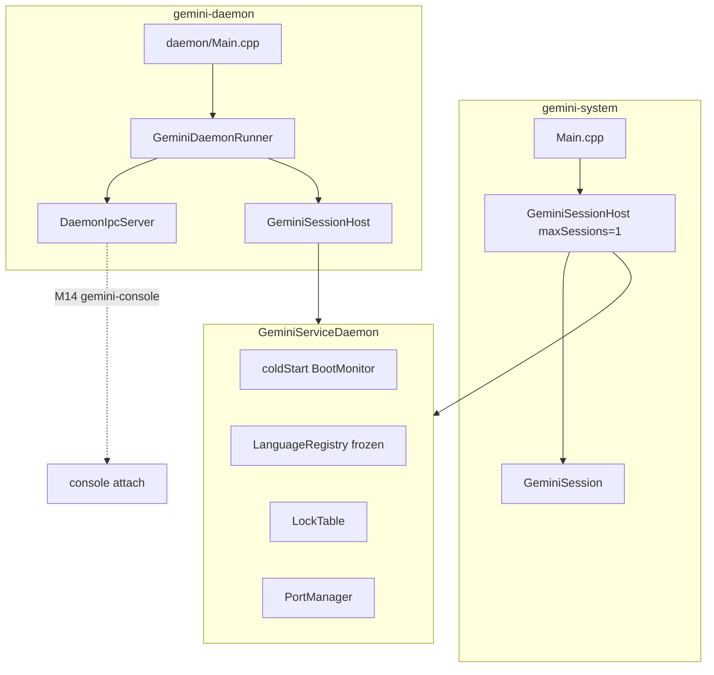

# Gemini Service Daemon (GSD)

The **Gemini Service Daemon** is the process-scope host for Gemini System: cold start, frozen language registry, shared lock table, port allocation, session table, and (for the long-running binary) a minimal Unix domain IPC server.

It is the architectural hinge between the M12 session object ([session model](session.md)) and multi-console attachment in [Milestone 14](milestones/14-multi-session-console-support.md).

See [Milestone 13](milestones/13-service-daemon-architecture.md) for delivery history and completion criteria.

## Entry points

Both binaries link the same daemon host implementation in `gemini-core` / `gemini-tcl` — not parallel codebases.

| Binary | Composition | I/O / IPC |
|--------|-------------|-----------|
| **`gemini-system`** | [`createEmbedded()`](../src/core/daemon/GeminiServiceDaemon.cpp) → [`GeminiSessionHost`](../src/userland/tcl/GeminiSessionHost.h) (`maxSessions = 1`) → one [`GeminiSession`](../src/userland/tcl/GeminiSession.h) → login/REPL | `stdin` / `stdout` / `stderr`; **no IPC server** |
| **`gemini-daemon`** | [`create(config)`](../src/core/daemon/GeminiServiceDaemon.cpp) → `GeminiSessionHost` → [`GeminiDaemonRunner`](../src/userland/tcl/GeminiDaemonRunner.cpp) | Unix domain socket; idle service host until M14 consoles attach |

[`Main.cpp`](../src/Main.cpp) hosts the embedded path. [`src/daemon/Main.cpp`](../src/daemon/Main.cpp) hosts the long-running daemon.

## Process vs session scope

| Scope | Owned by | Examples |
|-------|----------|----------|
| **Process (GSD)** | [`GeminiServiceDaemon`](../src/core/daemon/GeminiServiceDaemon.h) | [`BootMonitor`](../src/core/boot/BootMonitor.h), frozen [`LanguageRegistry`](../src/core/languages/LanguageRegistry.h), shared [`LockTable`](../src/core/locking/LockTable.h), [`PortManager`](../src/core/daemon/PortManager.h), [`DaemonIpcServer`](../src/core/daemon/DaemonIpcServer.h) (daemon binary only) |
| **Composition (userland)** | [`GeminiSessionHost`](../src/userland/tcl/GeminiSessionHost.h) | [`SessionTable`](../src/userland/tcl/SessionTable.h), [`SerialSessionRunner`](../src/core/daemon/SerialSessionRunner.h) |
| **Session** | [`GeminiSession`](../src/userland/tcl/GeminiSession.h) | [`Runtime`](../src/core/vm/Runtime.h), [`Shell`](../src/userland/tcl/Shell.h), account binding, per-session filesystem root, lock session id, I/O channels |

`SessionTable` lives in **`src/userland/tcl/`** (not `core/daemon/`) so `gemini-core` does not depend on userland session types.

## Architecture



## Component map

```text
src/core/daemon/     GeminiServiceDaemon, PortManager, SerialSessionRunner,
                     DaemonConfig, DaemonIpcProtocol, DaemonIpcServer
src/userland/tcl/    SessionTable, GeminiSessionHost, GeminiDaemonRunner
src/daemon/Main.cpp  gemini-daemon entry
src/Main.cpp         gemini-system embedded entry
```

## Cold start

- **Once per process** — [`GeminiServiceDaemon::coldStart()`](../src/core/daemon/GeminiServiceDaemon.cpp) runs [`BootMonitor::runColdStart`](../src/core/boot/BootMonitor.cpp).
- A dedicated **bootstrap `Runtime`** inside the daemon loads language modules during cold start; session VMs are separate and receive the frozen registry via `setLanguageRegistry()` after cold start.
- Boot output goes to the stream passed to `coldStart()` (`std::cout` for both entry points today).

## Port manager

[`PortManager`](../src/core/daemon/PortManager.h) assigns stable Pick **port / session id** values:

- Allocated at [`SessionTable::createSession`](../src/userland/tcl/SessionTable.cpp)
- Released at `destroySession`
- Map key and [`SessionId`](../src/core/daemon/SerialSessionRunner.h) equal the port number (starting at **1**, lowest free reused on destroy)
- Feeds **`WHO`**, lock identity ([`makeSessionLockId`](../src/userland/tcl/GeminiSession.h)), and future admin listing (M17)

The port survives **`LOGOFF`** until session **destroy** (daemon-assigned; login does not set `whoPort`).

Embedded `gemini-system` uses `maxSessions = 1` / `PortManager(1)`; the operator typically sees port **1** after login.

## Serial execution

[`SerialSessionRunner`](../src/core/daemon/SerialSessionRunner.h) ensures **at most one** session runs interpreter work (REPL, BASIC, PROC, etc.) at a time. Other session objects may exist in the table but do not make progress until the runner grants the execution token.

This is **not** cooperative scheduling — see [Milestone 15](milestones/15-cooperative-multi-session-execution.md).

## Configuration

[`DaemonConfig`](../src/core/daemon/DaemonConfig.h) is resolved by [`resolveDaemonConfig`](../src/core/daemon/DaemonConfig.cpp) for `gemini-daemon`:

| Source | Settings |
|--------|----------|
| **CLI** | `--socket`, `--max-sessions`, `--pick-root`, `--catalog-root`, `--modules-root`, `--help` |
| **Environment** | `GEMINI_DAEMON_SOCKET`, `GEMINI_MAX_SESSIONS`, `GEMINI_FILESYSTEM_ROOT`, `GEMINI_CATALOG_ROOT`, `GEMINI_MODULES_PATH` |
| **Defaults** | Host paths from [`resolveDefaultHostPaths`](../src/core/host/HostBootstrap.cpp); socket `$XDG_RUNTIME_DIR/gemini.sock` or `/tmp/gemini.sock`; `maxSessions = 64` |

Embedded mode uses [`DaemonConfig::embedded()`](../src/core/daemon/DaemonConfig.h) (`maxSessions = 1`); socket path is ignored.

## Lifecycle (`gemini-daemon`)

[`GeminiDaemonRunner`](../src/userland/tcl/GeminiDaemonRunner.cpp):

1. Install **SIGTERM** / **SIGINT** handlers
2. `coldStart()` — boot banner
3. Start **IPC server** on configured socket path
4. Poll loop: accept clients, dispatch IPC, until shutdown requested
5. **Graceful shutdown** — stop IPC (unlink socket), destroy all sessions (release locks and ports)

Shutdown may also be triggered by an IPC **ShutdownRequest** or by destroying the daemon process.

**Not in M13:** systemd unit, journald, background detachment (Milestone 17).

## IPC protocol v1

Transport: **Unix domain stream socket** (`AF_UNIX`). Socket file mode **0600** (owner read/write only).

Authoritative wire layout: [`DaemonIpcProtocol.h`](../src/core/daemon/DaemonIpcProtocol.h).

### Frame layout (network byte order)

```text
magic[4]   = "GEMI"
version    = uint16  (protocol version 1)
type       = uint16  (message type)
payloadLen = uint32
payload[]  = type-specific (may be empty)
```

### Message types (M13)

| Type | Direction | Purpose |
|------|-----------|---------|
| `Handshake` | client → server | Protocol version negotiation (required first) |
| `HandshakeAck` | server → client | Server version, `maxSessions`, build version string |
| `Ping` / `Pong` | either | Liveness check |
| `ShutdownRequest` / `ShutdownAck` | client → server | Request graceful daemon shutdown |
| `ReserveSession` / `ReserveSessionAck` | client → server | Stub: create session object, return port (no login/REPL) |
| `Error` | server → client | Protocol or capacity error |

### M13 boundary

IPC in M13 is **transport plumbing only**:

- **No** catalogue login over the socket
- **No** Tcl/BASIC/PROC REPL byte stream
- **No** console multiplexing

Those are [Milestone 14](milestones/14-multi-session-console-support.md). M13 `ReserveSession` only allocates a session slot and returns a port number.

### Multi-client connections (M14 Stage 2)

[`DaemonIpcServer`](../src/core/daemon/DaemonIpcServer.cpp) accepts **multiple concurrent** Unix socket clients. Each connection maintains its own handshake state and read buffer; the daemon run loop uses `pollAndDispatch()` to service all connections without blocking on a single client. Control-plane messages (`Handshake`, `Ping`, `ShutdownRequest`, `ReserveSession`) work per connection; clients stay connected after `Ping` or `ReserveSession` until they disconnect or send `ShutdownRequest`.

### Session I/O bridge (M14 Stage 3)

[`IpcSessionChannel`](../src/core/daemon/IpcSessionChannel.h) provides IPC-backed `std::istream` / `std::ostream` adapters. On `AttachSession`, [`GeminiDaemonRunner`](../src/userland/tcl/GeminiDaemonRunner.cpp) binds those streams to the target [`GeminiSession`](../src/userland/tcl/GeminiSession.h) via `setInputStream` / `setOutputStream` / `setDiagnosticStream`.

- **`AttachSession`** with `requestedPort = 0` creates a session (same allocation path as `ReserveSession`); a non-zero port attaches to an existing detached session.
- **`SessionInput`** frames append to the session input queue; session code reads via blocking `input()` as in embedded mode.
- Session **`output()`** / **`diagnostic()`** writes are queued and flushed as **`SessionOutput`** / **`SessionDiagnostic`** frames on the next `pollAndDispatch()` cycle (including `POLLOUT` retry when the socket would block).
- **`DetachSession`** or connection close unbinds the connection from the session; the session object remains in the table.
- **At most one live console per session** — a second attach to the same port receives `SessionAlreadyBound`.

Login and REPL orchestration over the bridge land in M14 Stage 5–6; Stage 3 wires transport only.

### Message types (M14 session plane)

Wire types and payload layouts are defined in [`DaemonIpcProtocol.h`](../src/core/daemon/DaemonIpcProtocol.h). Attach, detach, and session I/O are handled server-side in [`DaemonIpcServer`](../src/core/daemon/DaemonIpcServer.cpp); the wire spec is authoritative in the header.

| Type | Direction | Purpose |
|------|-----------|---------|
| `AttachSession` | client → server | Bind connection to session; `requestedPort = 0` creates a new session |
| `AttachSessionAck` | server → client | Assigned or confirmed `sessionPort` |
| `DetachSession` | client → server | Graceful console detach (empty payload) |
| `DetachSessionAck` | server → client | Detach complete (empty payload) |
| `SessionInput` | client → server | Stdin byte chunk for attached session |
| `SessionOutput` | server → client | Stdout byte chunk |
| `SessionDiagnostic` | server → client | Stderr byte chunk |

**Session-plane rules:**

- **Handshake first** (same as M13 control plane)
- **AttachSession** before any session I/O on that connection
- Session I/O frames are **connection-scoped** (no port field after attach)
- **SessionInput** is client → server only; **SessionOutput** and **SessionDiagnostic** are server → client only
- **DetachSession** or connection close ends the binding; the session object may remain in the table (M14 Stage 6)
- Max data chunk per session I/O frame: **65532 bytes** (`kDaemonIpcMaxSessionDataSize`)

**M14 error codes** (delivered in `Error` frames): `SessionNotFound`, `SessionAlreadyBound`, `NotAttached`.

`ReserveSession` remains for M13 compatibility; **`gemini-console`** uses `AttachSession` with `requestedPort = 0` instead.

## M13 vs M14 vs M15

| Milestone | What “multi-session” means |
|-----------|----------------------------|
| **M13** | Multiple session **objects** in table; **serial** execution; IPC **plumbing** only |
| **M14** | Multiple **attached consoles**; login/REPL over IPC; still serial execution |
| **M15** | Multiple sessions **make progress** via cooperative yield at I/O boundaries |

## Invariants

- One cold start per process
- One frozen `LanguageRegistry` per process until daemon restart
- One shared `LockTable` per process; per-session lock ids remain distinct ([concurrency](concurrency.md))
- At most one running interpreter stack across sessions (serial runner)
- Port uniqueness — no two live sessions share the same port / session id

## Source map

| File | Role |
|------|------|
| [`GeminiServiceDaemon.h`](../src/core/daemon/GeminiServiceDaemon.h) | Process host, cold start, shared substrate |
| [`GeminiSessionHost.h`](../src/userland/tcl/GeminiSessionHost.h) | Daemon + session table + serial runner |
| [`GeminiDaemonRunner.h`](../src/userland/tcl/GeminiDaemonRunner.h) | Foreground run loop, IPC integration, shutdown |
| [`DaemonConfig.h`](../src/core/daemon/DaemonConfig.h) | Configuration resolution |
| [`DaemonIpcServer.h`](../src/core/daemon/DaemonIpcServer.h) | Unix socket server |
| [`DaemonIpcProtocol.h`](../src/core/daemon/DaemonIpcProtocol.h) | Wire protocol v1 |

## See also

- [Session model](session.md) — `GeminiSession` lifecycle and I/O
- [Gemini bootstrap](gemini-bootstrap.md) — catalogue, login, cold-start banner
- [Concurrency and record locking](concurrency.md) — shared lock table and session ids
- [Milestone 14 — Multi-session console](milestones/14-multi-session-console-support.md) — `gemini-console` and REPL over IPC
