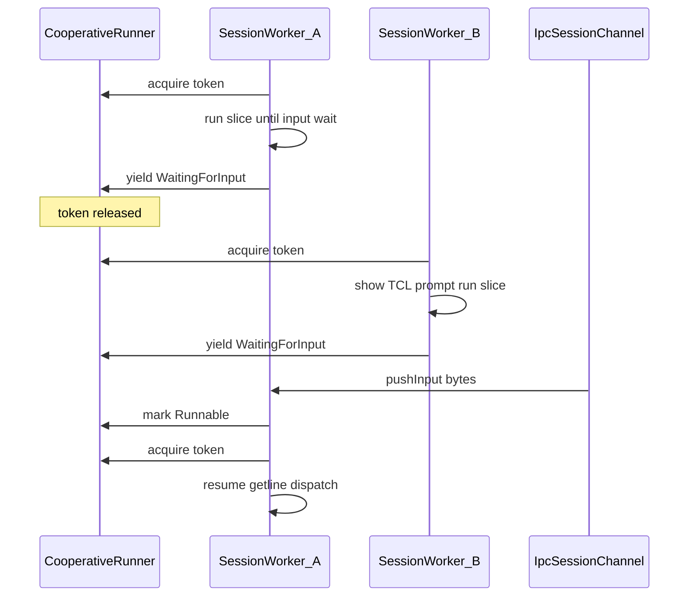

← [Project milestones index](../milestones.md)

## Milestone 15 — Cooperative Multi-Session Execution

Allow multiple attached sessions to **make progress concurrently** without true preemptive threading. Introduce a **cooperative scheduler** that switches the exclusive execution token at documented **I/O yield points**. Paused sessions retain full VM, shell, and lock-binding state. Apply simple fairness (round-robin among runnable sessions, run-until-next-yield). No preemption mid-instruction—preserving Pick authenticity and the single-interpreter-stack invariant from M12–M14. *Status: implemented.*

M14 delivered multiple consoles and sessions over IPC, but [`SerialSessionRunner`](../../src/core/daemon/SerialSessionRunner.cpp) still holds the execution token for an entire [`runExclusive`](../../src/userland/tcl/GeminiSessionHost.h) callback—today the whole login → REPL worker in [`GeminiDaemonRunner`](../../src/userland/tcl/GeminiDaemonRunner.cpp). A second session **blocks** until the first releases the token, typically only at REPL exit or detach. M15 replaces that coarse exclusivity with **slice-based cooperative scheduling** at session I/O boundaries.

---

### 1. Purpose and rationale

Before M15, “multi-session” in production means:

- Multiple **session objects** and **consoles** exist (M13–M14)
- **At most one** session executes interpreter work—but the token is held across **blocking I/O waits**, so other sessions cannot even reach their **`LOGON PLEASE:`** or **`TCL>`** prompt

That is correct for M14’s serial-runner stub, but it is not Pick-authentic multi-user **responsiveness**: operators expect each attached terminal to accept input when idle, even while another session runs a long program (until M15, the second terminal appears hung).

M12 defined session-owned I/O channels as the natural switch boundary. M14 bridged those channels over IPC ([`IpcSessionChannel`](../../src/core/daemon/IpcSessionChannel.h)). M15 teaches the **execution scheduler** to **release the token before blocking on session input** and **resume** the session when input arrives—without ever running two interpreter stacks at once.

The design constraint from M12–M14 carries forward: **`gemini-system` external behaviour must not regress**; cooperative scheduling applies to the daemon multi-session path (`maxSessions > 1`). Embedded single-session mode may use the same scheduler API but degenerates to today’s serial behaviour.

---

### 2. Scope

#### 2.1 Cooperative scheduler (replace coarse `runExclusive` semantics)

- Extend or supersede [`SerialSessionRunner`](../../src/core/daemon/SerialSessionRunner.h) with a **cooperative execution controller** (name TBD in implementation: e.g. `CooperativeSessionRunner`)
- **Acquire** the execution token only while actively running interpreter work (Tcl dispatch, BASIC step, VM opcode, login credential processing between reads—not while parked waiting for bytes)
- **Yield** at documented boundaries: release token, mark session **waiting**, notify scheduler
- **Resume** when session input becomes available (IPC `pushInput`, embedded stdin) or an explicit wake condition is met
- **Fairness:** round-robin (or equivalent simple policy) among **runnable** sessions; no OS time slices

#### 2.2 Yield points (v1 enumeration)

Cooperative scheduling requires an explicit list; without it M15 becomes open-ended. **M15 v1 yield boundaries:**

| Boundary | Location (anticipated) | Notes |
|----------|----------------------|-------|
| Session input read (blocking) | [`IpcSessionChannel::readInputChar`](../../src/core/daemon/IpcSessionChannel.cpp), embedded `std::istream` wrapper | Primary switch point for consoles |
| Catalogue login read | [`LoginService::runCatalogLogin`](../../src/core/login/LoginService.h) | Same cadence as embedded; yield before each blocking read |
| Tcl REPL line read | [`Shell::runTclRepl`](../../src/userland/tcl/Shell.cpp) `getline` | Prompt visible **before** yield so operator sees `TCL>` |
| BASIC / VM input | [`Runtime`](../../src/core/vm/Runtime.cpp) `INPUT` / `INPUT_STR` (and int input) via session streams | Session A in `INPUT` must not block session B’s REPL |
| Assembler debugger wait | Assembler shell `STEP` / blocked read in debug mode | Stretch in Stage 6 if needed |
| Explicit sleep (future) | Optional `SLEEP` Tcl/BASIC hook | Stub or defer if not needed for exit criteria |

**Not yield points in M15:** mid-opcode VM execution, mid-`handleLine` Tcl dispatch, lock table operations, filesystem reads that complete synchronously in-process (unless proven to block on external I/O—defer).

#### 2.3 Daemon session worker refactor

[`GeminiDaemonRunner`](../../src/userland/tcl/GeminiDaemonRunner.cpp) today:

```cpp
host_.runExclusive(port, [/* entire login + REPL loop */]);
```

M15 refactors to **slice-based** execution:

- Session worker thread remains (IPC poll loop unchanged)
- Worker drives login/REPL in **steps**, yielding between blocking reads
- Token **not** held while worker thread is parked on session input condition variable

#### 2.4 Session state preservation

When yielded, a session retains:

- Full [`GeminiSession`](../../src/userland/tcl/GeminiSession.h) VM and shell stack (Tcl, nested BASIC, PROC, assembler mode)
- Account binding and [`whoPort`](../../src/userland/tcl/GeminiSession.h)
- Lock bindings ([Milestone 10](10-record-locking-multi-user.md))—locks are **not** released on yield
- IPC stream bindings until detach

#### 2.5 Embedded / standalone path

**`gemini-system`** (`maxSessions = 1`): scheduler API shared, but only one session exists—behaviour identical to today. **No** operator-visible change required.

#### 2.6 Execution model (M13 vs M14 vs M15)

| Milestone | What “multi-session” means |
|-----------|----------------------------|
| **M13** | Multiple session **objects** in table; **serial** execution; IPC plumbing only |
| **M14** | Multiple **attached consoles**; login/REPL over IPC; token held across I/O wait |
| **M15** | Multiple sessions **make progress**; token released at I/O yield; still one running interpreter stack |

---

### 3. Architecture

#### 3.1 Cooperative scheduling flow



#### 3.2 Component relationships (after M15)

```text
  gemini-console A          gemini-console B
        |                         |
        +-------- IPC -------------+
                    |
            +-------v--------+
            | gemini-daemon  |
            | GeminiDaemon   |
            | Runner         |
            +-------+--------+
                    |
        +-----------v-----------+
        | CooperativeSession    |
        | Runner (replaces      |
        |  coarse serial hold)  |
        +-----------+-----------+
                    |
        +-----------+-----------+
        | GeminiSessionHost     |
        | SessionTable          |
        +-----------+-----------+
                    |
         +----------+----------+
         |                     |
   +-----v-----+         +-----v-----+
   | Session 1 |         | Session 2 |
   | Waiting   |         | Running   |
   | at TCL>   |         | slice     |
   +-----------+         +-----------+
```

#### 3.3 Scheduler invariants

- **At most one** session holds the execution token at any instant (same as M13–M14)
- **At most one** interpreter stack active—no concurrent VM reentrancy
- Yield is **cooperative only**—no preemption mid-command
- Scheduler is **process-local**—no distributed sessions

---

### 4. Invariants

- One cold start per process (unchanged)
- One frozen `LanguageRegistry` per process (unchanged)
- One shared `LockTable` per process; per-session lock ids distinct ([concurrency](../concurrency.md))
- **At most one running interpreter stack** across sessions—cooperative yield does not violate this
- Port uniqueness and detach ≠ destroy semantics unchanged from M14
- Session M12 invariants hold—one `Runtime`, one shell stack per session object
- **`gemini-system` smoke checklist** passes after every stage

---

### 5. Non-goals

Milestone 15 does **not** introduce:

- Preemptive time slicing or pthread-per-session VM execution
- Parallel interpreter stacks or lock-free shared VM state
- Changes to Tcl/BASIC/PROC/ENGLISH **command semantics** or locking rules
- IPC protocol changes (M14 session plane unchanged)
- Remote telnet/SSH, systemd, admin **`LISTSESSIONS`** ([**Milestone 17**](17-service-integration-deployment.md))
- Application-edition install/packaging ([**Milestone 17**](17-service-integration-deployment.md)); edition docs in [**Milestone 18**](18-version-1-gemini-system-service.md)
- Fairness beyond simple round-robin (priority queues, account quotas)
- Yield inside tight CPU-bound loops with no I/O — see [**Milestone 21**](21-execution-fairness-cpu-bound-yield.md) (deferred post–Version 1.0)

### Post-M15 follow-ups (deferred)

- **CPU-bound execution fairness** — opcode-budget yield in VM step loops, operator **BREAK** / cancel, optional output-backpressure yield ([**Milestone 21**](21-execution-fairness-cpu-bound-yield.md); after standalone VM and R83-compat work)
- Standalone host-native VM runner ([**Milestone 19**](19-standalone-vm-runner.md))

---

### 6. Compatibility expectations

- **`gemini-system`** manual smoke (§9) unchanged—single session, direct stdio
- M14 console attach/detach/graceful semantics unchanged
- Login cadence and error messages unchanged ([`LoginService`](../../src/core/login/LoginService.h))
- Locking and multi-language behaviour unchanged ([M10](10-record-locking-multi-user.md), [M11](11-multi-language-runtime-infrastructure.md))
- **`WHO`**, port policy, and session identity unchanged
- Operator-visible **change** is intentional: second console is responsive at prompts while first is idle at its own prompt—not a protocol break

---

### 7. Dependencies and grounding

- Builds on [**Milestone 14**](14-multi-session-console-support.md) — multi-console IPC, session workers, [`IpcSessionChannel`](../../src/core/daemon/IpcSessionChannel.h)
- Builds on [**Milestone 13**](13-service-daemon-architecture.md) — `GeminiSessionHost`, session table, port manager
- Builds on [**Milestone 12**](12-session-model-foundation.md) — session I/O channels as yield boundary
- [`docs/daemon.md`](../daemon.md) documents serial runner today; M15 extends with cooperative scheduling
- [`docs/console.md`](../console.md) serial-runner note becomes cooperative scheduling note at closure

---

### 8. Deliverables

**Code (anticipated paths):**

- **Cooperative scheduler** — extend/replace [`SerialSessionRunner`](../../src/core/daemon/SerialSessionRunner.h) under `src/core/daemon/`
- **Schedulable session I/O** — yield-aware input path on [`IpcSessionChannel`](../../src/core/daemon/IpcSessionChannel.h) and/or [`GeminiSession`](../../src/userland/tcl/GeminiSession.h) stream indirection
- **Slice-based session worker** — refactor [`GeminiDaemonRunner`](../../src/userland/tcl/GeminiDaemonRunner.cpp) login/REPL loop
- **Interpreter yield hooks** — [`Shell::runTclRepl`](../../src/userland/tcl/Shell.cpp), [`LoginService`](../../src/core/login/LoginService.h), [`Runtime`](../../src/core/vm/Runtime.cpp) input opcodes (minimal surface)

**Tests:**

- `tests/core/test_CooperativeSessionRunner.cpp` — token acquire/yield/resume, fairness, two-session alternation
- `tests/core/test_SchedulableSessionIo.cpp` — blocked read releases token; `pushInput` wakes session
- Extend [`tests/console/test_GeminiConsole.cpp`](../../tests/console/test_GeminiConsole.cpp) — **two consoles both receive prompts** without one blocking the other at login/REPL idle
- Extend [`tests/core/test_SessionIoBridge.cpp`](../../tests/core/test_SessionIoBridge.cpp) as needed for yield wakeups
- Existing M14 integration tests remain green

**Documentation:**

- Extend [`docs/daemon.md`](../daemon.md) — cooperative scheduler, yield points, M15 vs M14 behaviour
- Update [`docs/session.md`](../session.md) — execution states (running / waiting)
- Update [`docs/console.md`](../console.md) — remove “second console blocks at serial runner” as final behaviour; document cooperative prompts
- Milestone index and this document marked **implemented** at Stage 7 closure

---

### 9. Milestone completion criteria

- **Cooperative scheduler** releases the execution token at v1 yield points; only one session runs interpreter work at a time
- **Two attached consoles** at **`LOGON PLEASE:`** or **`TCL>`** both accept input without either appearing hung while the other is idle at a prompt
- Session **B** can run Tcl while session **A** waits in BASIC **`INPUT`** (or equivalent VM input opcode)
- Yielded sessions retain VM/shell/login/lock state; resume continues correctly
- **Fairness:** neither session starves under alternating input (round-robin smoke)
- **`gemini-system`** passes manual smoke unchanged
- All existing tests pass; new tests cover scheduler and multi-console prompt concurrency
- Documented in [`docs/daemon.md`](../daemon.md)

**Manual smoke checklist — `gemini-system`** (must pass after every stage):

1. Boot with catalogue → interactive or auto LOGON
2. Tcl: `VERSION`, `WHO`
3. Enter BASIC → run a one-line program → `END`
4. `LOGOFF` → re-login
5. `QUIT` → clean process exit

**Manual smoke checklist — `gemini-daemon` + `gemini-console`** (required for milestone closure):

1. Start `gemini-daemon` on a temp socket with catalogue configured
2. Launch **two** `gemini-console` instances → each completes login → **`WHO`** shows distinct ports
3. **Both** consoles show **`TCL>`** and accept commands **without waiting for the other to QUIT**
4. On console A: enter **`BASIC`**, run a program with **`INPUT`**; on console B: run a Tcl command while A waits at **`INPUT`**
5. Graceful detach on one console → re-attach → session state preserved (M14 regression)
6. `QUIT` both consoles → `SIGTERM` daemon → clean exit

---

### 10. Delivery plan

Implementation is sequenced into vertical stages. Each stage ships a test-locked slice before the next starts; the full test suite must remain green after every stage. **`gemini-system` external behaviour must not regress** until Stage 7 claims milestone closure. Detailed per-stage plans may live in `~/.cursor/plans/m15_stage_*.plan.md` during implementation; status is summarised here as each stage lands (matching the M12 / M13 / M14 precedent).

- **Stage 1 — Cooperative runner foundation**: introduce scheduler API (session run states: `Runnable`, `Running`, `WaitingForInput`; `acquire` / `yield` / `resume`); refactor [`SerialSessionRunner`](../../src/core/daemon/SerialSessionRunner.h) or add parallel type; wire through [`GeminiSessionHost`](../../src/userland/tcl/GeminiSessionHost.h) without changing interpreters yet. **Exit criterion:** unit tests prove two session ids alternate token ownership via explicit yield/resume; embedded `maxSessions=1` path unchanged. Tests: `tests/core/test_CooperativeSessionRunner.cpp`. *Status: implemented.*

- **Stage 2 — Schedulable session input**: yield before blocking read in [`IpcSessionChannel`](../../src/core/daemon/IpcSessionChannel.cpp) (and embedded stdin wrapper if needed); waking on `pushInput` marks session runnable and notifies scheduler. **Exit criterion:** test demonstrates blocked `input().get()` releases token; second session acquires; first resumes after bytes pushed. Tests: `tests/core/test_SchedulableSessionIo.cpp`. *Status: implemented.*

- **Stage 3 — Login yield + daemon worker slices**: refactor [`GeminiDaemonRunner`](../../src/userland/tcl/GeminiDaemonRunner.cpp) to stop holding one `runExclusive` for the entire worker; integrate login [`LoginService::runCatalogLogin`](../../src/core/login/LoginService.h) reads with yield. **Exit criterion:** two-console integration test—both sessions display **`LOGON PLEASE:`** concurrently. Tests: extend `test_GeminiConsole.cpp`. *Status: implemented.*

- **Stage 4 — Tcl REPL yield**: [`Shell::runTclRepl`](../../src/userland/tcl/Shell.cpp) yields at line input wait (prompt emitted before yield). **Exit criterion:** two consoles both show **`TCL>`** and accept lines interleaved. Tests: extend `test_GeminiConsole.cpp`. *Status: implemented.*

- **Stage 5 — BASIC / VM input yield**: [`Runtime`](../../src/core/vm/Runtime.cpp) `INPUT` / `INPUT_STR` (and int input) yield through session streams; PROC/Tcl paths that block on session input covered as needed. **Exit criterion:** integration or unit test—session A blocked in BASIC **`INPUT`**, session B executes Tcl **`WHO`**. *Status: implemented.*

- **Stage 6 — Fairness policy + debugger yield (stretch)**: round-robin runnable queue; optional assembler **`STEP`** / debug wait yield; starvation regression test. **Exit criterion:** three-session round-robin smoke under synthetic input; debugger yield documented or explicitly deferred with stub. *Status: implemented.* Ships round-robin election in [`CooperativeSessionRunner`](../../src/core/daemon/CooperativeSessionRunner.cpp), three-session unit/integration tests, and debugger **wait** yield via existing IPC transport (ASM> through `readPromptedInputLine`; BASIC `*` through same helper after polish). ASM `STEP`/`RUN`/`CONT` CPU stepping remains out of scope.

- **Stage 7 — Docs + closes M15**: update [`docs/daemon.md`](../daemon.md), [`docs/session.md`](../session.md), [`docs/console.md`](../console.md); milestone index; audit §9 completion criteria; full test suite + both smoke checklists. **Closes Milestone 15.** *Status: implemented.* Cooperative scheduler, yield points, and operator runbooks documented; automated test suite green.

Only Stage 7's exit criteria should claim "Closes Milestone 15".

*Status: implemented.*
